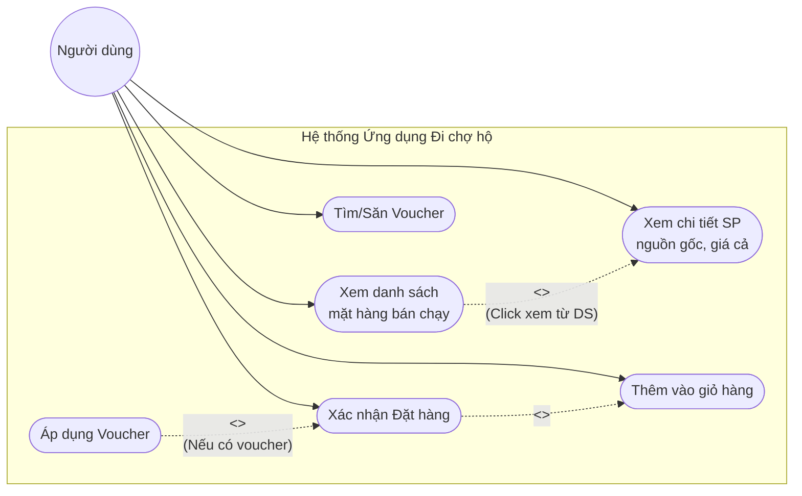
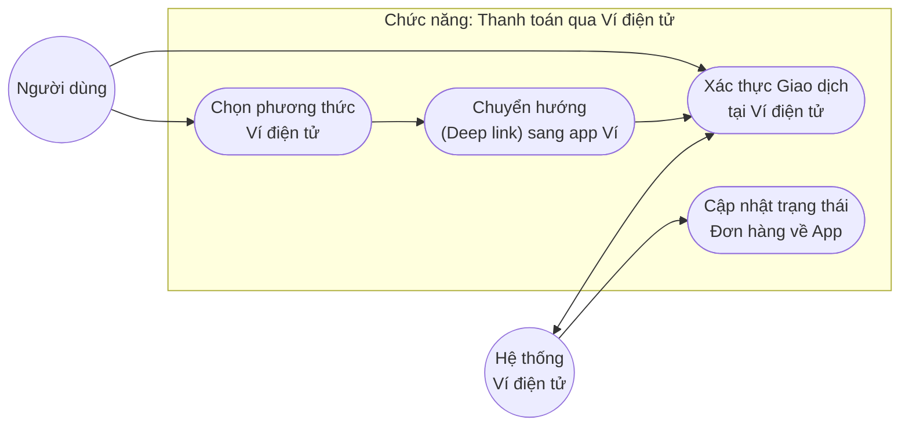

# Use Case và Scenario: Ứng dụng Đi chợ hộ

Dựa trên yêu cầu tiếp cận đa dạng đối tượng người dùng (học sinh, sinh viên, người đi làm, người cao tuổi, phụ huynh, người nước ngoài...) và các hành vi đặc trưng (ưu tiên mặt hàng bán chạy, quan tâm giá cả/nguồn gốc, thích săn voucher), dưới đây là chi tiết Use Case và Scenario cho 2 chức năng chính.

## 1. Chức năng: Đặt hàng trong ứng dụng

### Biểu đồ Use Case (Use Case Diagram)

### Kịch bản (Scenario) chi tiết

- **Tên Use Case (Use Case Name):** Đặt hàng trong ứng dụng
- **Tác nhân (Actor):** Người dùng (Học sinh, sinh viên, người đi làm, người cao tuổi, phụ huynh có con nhỏ, người nước ngoài...).
- **Điều kiện tiên quyết (Pre-condition):** Người dùng đã Mở ứng dụng và Đăng nhập thành công.
- **Điều kiện hậu quyết (Post-condition):** Đơn hàng được tạo thành công trên hệ thống và chuyển sang trạng thái chờ thanh toán/xử lý.

**Kịch bản cơ bản (Basic/Main Flow):**
1. Người dùng mở trang chủ của ứng dụng. Hệ thống ngay lập tức ưu tiên hiển thị danh sách **"Các mặt hàng bán chạy nhất"** lên vị trí đầu tiên.
2. Người dùng lướt xem danh sách và nhấn chọn vào một sản phẩm bán chạy (hoặc gõ tìm kiếm sản phẩm).
3. Hệ thống hiển thị **trang chi tiết sản phẩm**. Tại đây cung cấp **nguồn gốc rõ ràng**, **chất lượng** và đánh giá của khách cũ.
4. Người dùng hài lòng với giá cả hợp lý, nhấn nút **"Thêm vào giỏ hàng"**.
5. Người dùng truy cập vào **Giỏ hàng**, kiểm tra lại danh sách sản phẩm và nhấn nút **"Tiến hành đặt hàng"**.
6. Tại màn hình xác nhận đơn, hệ thống gợi ý mục **"Săn Voucher/Ưu đãi"**. Người dùng (như sinh viên, người đi làm) click chọn mã giảm giá/voucher để tiết kiệm chi phí.
7. Người dùng **Áp dụng Voucher** để giảm tổng tiền giao dịch.
8. Người dùng kiểm tra lại thông tin giao nhận và nhấn nút **"Đặt hàng"**.
9. Hệ thống lưu lại đơn hàng, thông báo thành công và chuyển sang bước thanh toán.

**Kịch bản ngoại lệ (Alternative/Exception Flow):**
- **Sản phẩm hết hàng:** Tại bước 3, nếu sản phẩm tạm hết, nút "Thêm vào giỏ hàng" sẽ bị mờ, hiển thị "Tạm thời hết hàng" và tự động gợi ý các sản phẩm bán chạy tương tự.
- **Voucher không hợp lệ:** Nếu người dùng nhập sai mã voucher hoặc voucher đã hết lượt, hệ thống báo lỗi rõ ràng: *"Voucher không áp dụng cho mặt hàng này hoặc đã hết lượt. Vui lòng chọn ưu đãi khác!"*. Quá trình trở lại bước 5.

---

## 2. Chức năng: Thanh toán qua Ví điện tử

### Biểu đồ Use Case (Use Case Diagram)

### Kịch bản (Scenario) chi tiết

- **Tên Use Case (Use Case Name):** Thanh toán qua Ví điện tử (hỗ trợ MoMo, ZaloPay, VNPay...)
- **Tác nhân (Actor):** Người dùng, Hệ thống Ví điện tử (E-Wallet System).
- **Điều kiện tiên quyết (Pre-condition):** Người dùng đã tạo đơn hàng thành công ở bước trước và đang ở màn hình chọn phương thức thanh toán. Điện thoại người dùng có cài đặt sẵn app Ví điện tử liên quan.
- **Điều kiện hậu quyết (Post-condition):** Đơn hàng được cập nhật trạng thái "Đã thanh toán" và gửi yêu cầu chuẩn bị hàng.

**Kịch bản cơ bản (Basic/Main Flow):**
1. Tại màn hình Phương thức thanh toán, hệ thống hiển thị tùy chọn **"Thanh toán qua Ví điện tử (Ví dụ: MoMo, ZaloPay...)"**.
2. Người dùng chọn Ví điện tử mong muốn và nhấn nút **"Xác nhận thanh toán"**.
3. Ứng dụng Đi chợ hộ sinh ra mã giao dịch bảo mật và tự động **chuyển hướng (Deep link)** mở ứng dụng Ví điện tử.
4. Người dùng sử dụng sinh trắc học (FaceID/Vân tay) hoặc mã PIN để mở khóa ứng dụng Ví điện tử.
5. Hệ thống Ví điện tử hiển thị màn hình hóa đơn rõ ràng với thông tin: *"Thanh toán đơn hàng Ứng dụng Đi chợ hộ - Tổng tiền: XXX VNĐ"*.
6. Người dùng kiểm tra lại thông tin và nhấn **"Xác nhận"** trên app Ví điện tử.
7. Hệ thống Ví điện tử xử lý trừ tiền, ghi nhận giao dịch thành công và **tự động chuyển hướng người dùng quay lại** Ứng dụng Đi chợ hộ.
8. API của Hệ thống Ví gọi về server Ứng dụng Đi chợ hộ thông báo thành công. Ứng dụng thay đổi trạng thái đơn hàng sang "Đã thanh toán" và hiển thị kết quả chúc mừng cho người dùng.

**Kịch bản ngoại lệ (Alternative/Exception Flow):**
- **Tài khoản ví không đủ tiền:** Tại bước 6, nếu Ví điện tử báo không đủ số dư, người dùng phải nạp thêm tiền tại chỗ hoặc bấm "Hủy giao dịch". Khi hủy, họ sẽ được đưa lại về Ứng dụng Đi chợ hộ với màn hình: *"Thanh toán thất bại hoặc đã bị huỷ"*, kèm theo nút "Lựa chọn phương thức thanh toán khác".
- **Hết thời gian giao dịch (Timeout):** Nếu người dùng qua app Ví điện tử nhưng treo máy, không xác nhận trong vòng 10-15 phút. Hệ thống Ví tự động hủy phiên giao dịch.
- **Ứng dụng ví điện tử chưa được cài đặt trên máy:** Hệ thống sẽ tự động mở trang web thanh toán của Ví điện tử trên trình duyệt (hiển thị mã QR) thay vì mở ứng dụng app trực tiếp.
